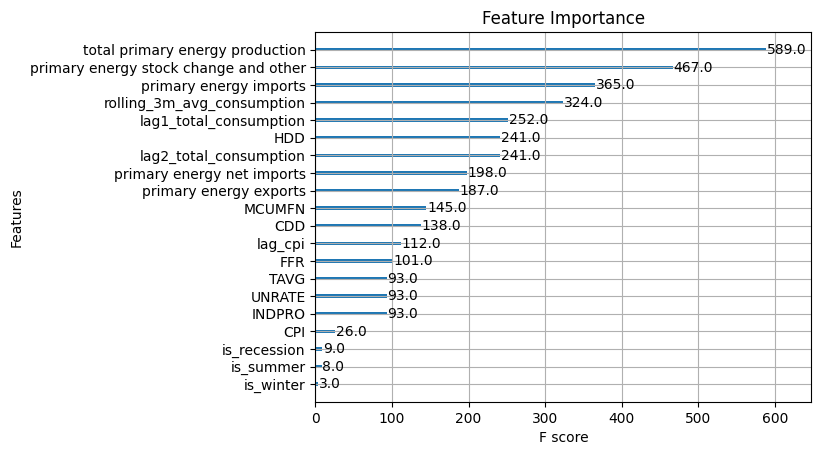
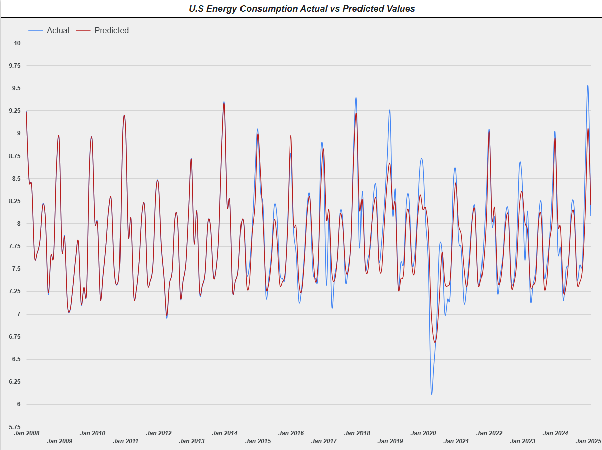
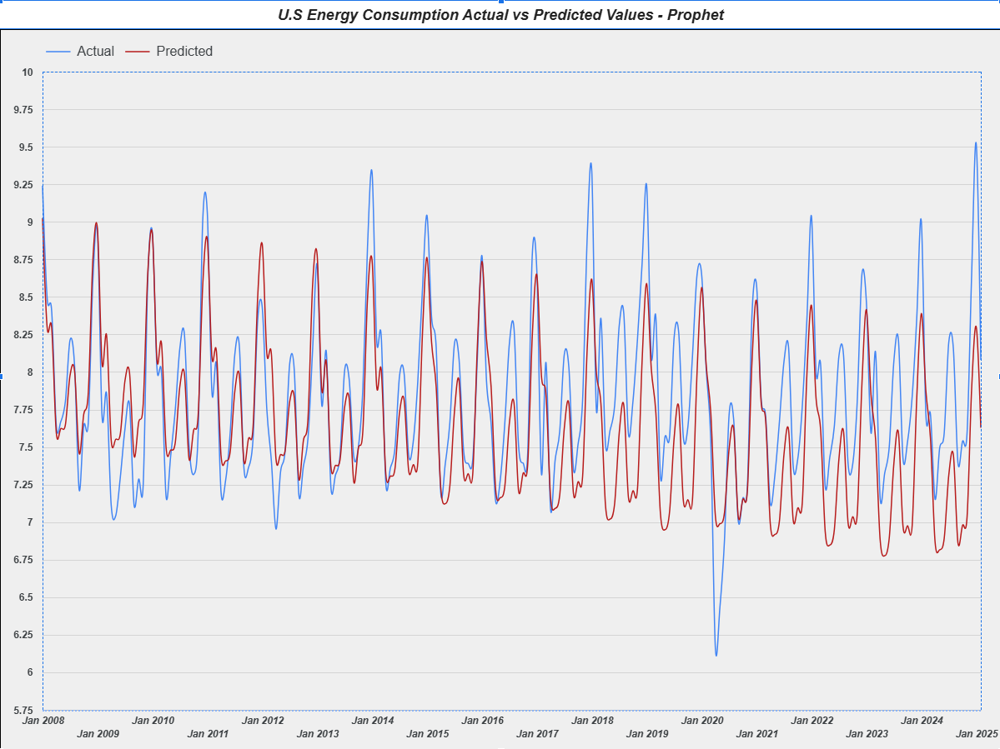

# U.S. Energy Consumption Forecasting Pipeline

## Tech Stack
- Python
- Google Cloud
- dbt (local)
- Prefect (via Python)

## Project Structure
This is an end-to-end machine learning pipeline forecasting United States Energy Consumption. There are three main data pipelines: one from the Energy Information Administration, another from the Federal Reserve Bank of St. Louis (FRED), and another from the National Oceanic and Atmospheric Administration (NOAA). The data is either downloaded via API (FRED) or through a direct CSV URL link in Python and is uploaded into 9 individual staging tables in Google BigQuery via pandas-gbq. There is some preprocessing done in Python, but the extent of it is skipping rows. I used dbt to transform the data, feature engineer, and unify the data into one final table. Some features that were created in dbt include the lagging features, the rolling average, and the "is" variables, such as "is_recession". Then I pull the data back into a local environment to run an XGBoost model in Python. Results are shown below, but overall, the model performed very well. The predictions/ results are then uploaded to Google BigQuery, which can then be exported or used in some data visualization tool. I personally created a dashboard plotting the actual vs predicted results in Looker Studio, which is embedded below. The entire pipeline up to the dashboarding/ export step is automated via Prefect (Python library version). Variables are stored in a local .env file, and I authenticated to Google Cloud via the terminal/ OAuth.

## Data Ingestion
Each "ingest" Python script in the prefect folder ingests data into BigQuery.

The econ pipeline connects data from the FRED API. The data is returned as JSON and is appended into a pandas DataFrame for upload into BigQuery. There are 5 datasets in the econ pipeline, which include the Consumer Price Index (CPIAUSCL), the Federal Funds Effective Rate (FEDFUNS), Industrial Production: Total Index (INDPRO), Unemployment Rate (UNRATE), Capacity Utilization: Manufacturing (MCUMFN), and NBER-defined recessions periods (USREC).

The weather pipeline downloads three CSVS from NOAA, reads as a pandas DataFrame, and is ingested into BigQuery via pandas-gbq. These datasets had minimal transformation, such as skipping the first three rows and formatting the date column. The dates were formatted as YYYYMM, and I made it MMYYYY. The three datasets are Average Temperature (F), Cooling Degree Days, and Heating Degree Days.

The energy pipeline downloads one file from the Energy Information Administration. The data is returned as an Excel file (.xlsx) and is read as a pandas DataFrame. The first 10 columns are redundant and are removed. Row 11 includes the column headers are appended to the DataFrame headers. The dataset is ingested into BigQuery via pandas-gbq. The dataset includes production, consumption rates of Fossil Fuels, Nuclear, and Total. It also includes production and imported energy amounts.

## dbt / Data Transformation
In the dbtFolder subdirectory, inside the models folder, there are two folders within staging and core. In staging, there are data models for each of the 9 tables that were uploaded to BigQuery. Each table is renamed to its file, and the date is cast as a date data type. In the core folder, the data is unified into one table called "energy_pipeline". Features are also engineered in dbt, which include a 1-month lagging feature for CPI and energy consumption, a 2-month lagging feature for energy consumption, a 3-month rolling average for energy consumption, and a few boolean variables, such as "is_recession", "is_winter", "is_summer". All data is INNER JOINED on the energy table's date, and since the dates are inner joined, the starting date for the table is January 1973 and ends in April 2025. 

The table is ingested into BigQuery and can be called by simply running dbt run in the terminal, if authenticated to Google Cloud/another cloud provider.

## Modeling / Forecasting
When I started this project, the goal was to run a machine learning model on the Cloud. However, I did not want to setup billing for this project, and the BigQuery ML models were not as robust as some of the models I can access locally, so I decided to run the model in my local environment. I ran four models: an ARIMA, a SARIMA, a Prophet, and an XGBoost models. Each model suffered from some overfitting, with XGBoost suffering the worst. The primary cause of this is due to a lack of data, only 620 or so rows. I tried backtesting the model, cross-validating, and other methods to help the models, but the lack of data was just too much to overcome.

The column that was chosen to be forecasted was 'total primary energy consumption'. To prevent leakage and multicollinearity, I removed all other consumption variables (not the lags or 3-month rolling average), and I also removed the non-total primary energy production variables. I also had to remove the date column during training, but the data stayed in chronological order even after training.

I would also like to mention that from the early 1980s through ~2019, many features (like energy production and imports) moved with relatively low structural change, meaning the model has little incentive to adjust heavily until the COVID-19 period, when demand shocks started to re-emerge, which if you look below at the results/graph you can cleary see the model starts to miss. I think adding WTI Crude prices to the model would help a lot, especially when the model hits recession periods, when energy patterns can change and are more visible. Some economic variables, such as CPI, the "is" flags, were not very important in the model. Below is a picture of the feature importance.

The training data was the first 80% of the dataset. Here is a graph of feature importance:

Features -

## Results  
Below is a table of each of the models' performance. I used linear regression due to energy consumption being a continuous variable. 

| Model             | R²   | MAE   | RMSE   | MSE  | MAPE |
|-------------------|------|-------|-------|-------|----------------------|
| `ARIMA`             | -.09 | .455  | .596   |  1.7  | 5.64%  | 
| `SARIMA`            | 0.79  | .203  | .262   | .069  | 2.60%  | 
| `Prophet`           | 0.93 | .181  | .236   |  .056 | 2.55%  |
| `XGBoost`           | 0.85 | .189  | .057   | .238  | 2.33%  |

As you can probably see, one model sticks out like a sore thumb. ARIMA has an R² score of -.09, while the rest of the models perform at a minimum of .79, which shows that the relationship between total energy consumption's variability is not explained by the rest of the dataset/ features. The reason this happens is that energy consumption is seasonal; winter and summer seasons use more energy than fall and spring, and ARIMA can not model this. Energy consumption is also dependent on macroeconomic trends. ARIMA also assumes linear relationships, so when a thing like a recession happens, it does not handle it well.

SARIMA performs much closer to the other two models, and that is simply because SARIMA can handle seasonal data. But has a higher error rate than Prophet, but overall I would state this is the second best model.

XGBoost does have a good R² score and has a low MAPE, but the RMSE is too low compared to the MAE, which means the model suffers from overfitting, which it does. The dataset is simply too small, with only 620 rows. XGBoost is more equipped to deal with much larger datasets, so it can learns too much during training and can not generalize to new data, and provides inaccurate predictions.

Prophet (Facebook) performed the best, which makes sense because it is great at modeling trends and seasonality, which is the essence of this project. It has an R² score of .93, which is showing an almost perfect relationship. The MAPE is also the second lowest of the four models. It also has the smallest difference between the RMSE and the MAE, which shows the model does not overfit easily.

 

## Visualization

Above are the results for XGBoost. Blue are the real world values, red are the predicted values / generalized from machine learning. Click the link above to check out the dashboard.

Above are the results for Prophet. Blue are the real world values, red are the predicted values.

